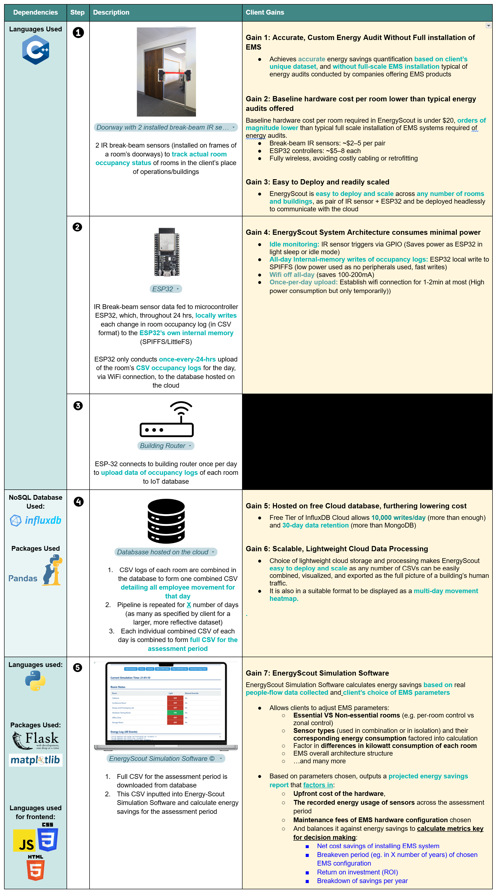

### EnergyScout
###### A lightweight, low-risk way to show hard data to unlock EMS savings using real people-flow data

Today, 60% of building assets is energy inefficient and it is expensive to obtain proof of cost savings for one’s specific building configuration and human footfall.

Energy-scout is a low-cost, real world data driven pre-installation advisory tool to determine the feasibility of installing Energy Management Systems (EMS), helping mid-to large sized companies unlock EMS savings using real people-flow data. It solves a specific pain point EMS vendors aren't addressing well: decision confidence, and at a much lower cost than EMS vendors.

# Tech Stack

