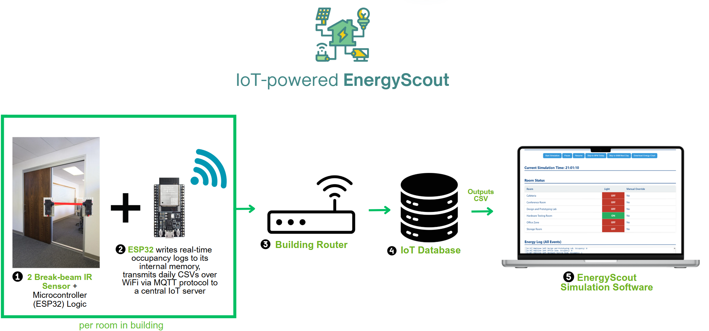

### EnergyScout
###### A lightweight, low-risk way to show hard data to unlock EMS savings using real people-flow data

Today, 60% of building assets is energy inefficient and it is expensive to obtain proof of cost savings for one’s specific building configuration and human footfall.

Energy-scout is a low-cost, real world data driven pre-installation advisory tool to determine the feasibility of installing Energy Management Systems (EMS), helping mid-to large sized companies unlock EMS savings using real people-flow data. It solves a specific pain point EMS vendors aren't addressing well: decision confidence, and at a much lower cost than EMS vendors.

1. Installs **low-cost IR break-beam sensors (2 per room, installed on frames of a room’s doorways)** to track **actual room occupancy status** of rooms in the client’s place of operations/buildings
2. Uses that data to simulate **how much lighting/HVAC energy would be saved** if those rooms were controlled based on real-time usage, quantifying energy savings for the building
3. Based on the specific configuration of EMS chosen:
  - Outputs a projected energy savings report that factors in:
    - Upfront cost of the hardware,
    - Energy usage of sensors,
    - Maintenance fees
    - And balances it against energy savings to calculate net cost savings of installing EMS system, its corresponding breakeven period (eg. in X number of years), return on investment (ROI) (breakdown of savings per year)

# What problems does EnergyScout solve?

<table><thead><tr><th>
Problems with current EMS providers</strong>
</th><th></th></tr><tr><th>
No cheap way to obtain hardproof of cost savings would offset cost of implementing EMS (eg. upfront hardware cost, extra electricity cost, maintenance cost):</strong>
<ol><li>The energy auditing service offered by established EMS companies is expensive, and this coupled with the conception that CapEx for sensors, meters, controllers, and software licenses is significant, makes companies less willing to install EMS as the barrier to obtain data-driven proof that cost savings from EMS would offset high upfront hardware is very high.</li><li>In fact, most EMS providers <strong>must install hardware</strong> to estimate savings accurately, which requires a substantial initial investment in hardware by the company, and without proof of the exact savings, this makes installation much more undesirable.</li><li><strong>Hardware cost, extra electricity cost, maintenance Cost: </strong>Ongoing maintenance of sensors and systems also has a cost</li></ol></th><th>
Does not require full installation of EMS system in order to obtain proof of savings - minimal upfront cost

Gathers real behavioral data

<strong>Justifies</strong> investment in EMS with concrete data
</th></tr><tr><th><ol><li><strong>Awareness: </strong>SMEs often don’t realize how much energy they’re wasting</li></ol></th><th>
minimal upfront cost to obtain proof of cost savings - able to conduct energy audits for these companies
</th></tr><tr><th><ol><li><strong>Integration Complexity: </strong>Older buildings with legacy HVAC/BMS systems may face technical barriers to integration.</li></ol></th><th>
Recommendations on how to implement EMS according to the client’s specific legacy systems
</th></tr><tr><th><ol><li><strong>Disruption to operations</strong></li></ol></th><th>
No disruption to operations
</th></tr><tr><th></th><th></th></tr></thead></table>

# Tech Stack of Energy Scout

<table><thead><tr><th></th><th>
Recommended Option
</th><th></th></tr><tr><th rowspan="3">
Languages Used

</th><th>
Break-beam IR sensor (pair with ESP32 GPIO input)
</th><th rowspan="3">
Hardware cost per room likely stays under $15–20, which is orders of magnitude lower than EMS hardware installs.
<ul><li>Break-beam IR sensors: ~$2–5 per pair</li><li>ESP32 controllers: ~$5–8 each (WiFi &amp; BLE built-in)</li><li>Fully wireless → avoids costly cabling or retrofitting </li></ul></th></tr><tr><th>
Controller for data logging: ESP32 running Arduino sketch to generate CSV for each room
</th></tr><tr><th>
Communication Network: WiFi-connected ESP-32 transmits CSV of each room collected for the day to IoT database
</th></tr><tr><th>
NoSQL Database:

</th><th>
In IoT Database:
<ol><li>CSV of each room is combined to form one combined CSV detailing employee movement into all rooms in building for that day</li><li>Pipeline is repeated for X number of days (as many as specified by client for a larger dataset for more accurate predictions)</li><li>Each individual combined CSV of each day is combined to form full CSV for the assessment period</li></ol></th><th>
Data-first and there is no need to "buy to try"
<ul><li>Allows room-level occupancy modeling without modifying existing HVAC or lighting.</li><li>The system collects real usage data, uses raw entry/exit logs to simulate EMS control scenarios in post-processing. </li></ul>
Lightweight cloud storage and processing makes this system easy to deploy and scale, especially across multiple buildings

as CSVs can be: 
<ul><li>Combined, visualized, exported </li><li>Shared with facility managers or energy consultants</li><li>Aggregating into a multi-day movement heatmap</li></ul></th></tr><tr><th>
Languages/Packages Used for backend:

Languages used for frontend:

</th><th>
Simulation Software
<ol><li>Full CSV for the assessment period is downloaded from database</li><li>This CSV inputted into Energy-Scout Simulation Software and calculate energy savings for the assessment period<ol><li>Clients are able to adjust EMS parameters (essential vs non-essential rooms, EMS power on and off duration, kilowatt comsumption of rooms, sensor choice/combinations of sensors and their respective power consumption during operations, EMS overall architecture etc.)</li><li>Based on parameters chosen, Outputs a projected energy savings report that factors in:<ol><li>Upfront cost of the hardware,</li><li>Energy usage of sensors,</li><li>Maintenance fees</li><li>And balances it against energy savings to calculate net cost savings of installing EMS system, its corresponding breakeven period (eg. in X number of years), return on investment (ROI) (breakdown of savings per year)</li></ol></li></ol></li></ol></th><th>
Simulation Software enables customization, making it a robust decision-making platform.
<ul><li>Allows clients to play with real parameters:<ul><li>Sensor types and their energy use</li><li>Room-specific kilowatt loads</li><li>EMS architectural decisions (e.g., per-room vs zonal control) </li></ul></li><li>Outputs all the business-critical metrics:<ul><li>Breakeven point</li><li>ROI breakdown</li><li>Energy savings/year</li><li>Net cost savings </li></ul></li></ul></th></tr></thead></table>

# Price Comparison

Energy Scout tool could be deployed for **<1% the cost** of a traditional EMS system **just to get a savings estimate**.

| **Feature** | **Current EMS vendors** | **EnergyScout** |
| ----------- | ----------- |--|
| Hardware Cost (Per Room) | $150–$1,000 (with smart relays, sensors, BMS integration) | ~$15–20  |
| Install Time | 1–3 hours per room + certified technician | 15–30 mins (DIY or light contractor) |
| Software License | $1,000s/year | Free or flat-rate simulation engine |
| System Intrusion | Full integration into light/HVAC | Zero disruption, data only |
| Data Collection Period | Only post-install | Pre-install, real usage logs |
| Advisory Service | Paid consulting or bundled with EMS | Free/low-cost standalone advisory |
| Scalability to 10+ Rooms | High cost + complexity | Just add ESPs + IRs |

# Key Selling Points:
1. Zero-risk EMS pre-screening: Real data, no system changes
2. Extremely low-cost hardware: <$20 per room
3. Lightweight & fast to deploy: Install and collect data same day
4. Highly customizable analysis: Tailored EMS ROI outputs
5. Scalable: Works for a single room or 100+ rooms

# EnergyScout Simulation Software Logic (By Default)

|     | With EMS | Without EMS |
|--| --| --|
| **Essential Rooms** | **Always ON** during working hours | **Always ON** during working hours |
| **Non-essential Rooms** | **ON only if occupied** | **Always ON** during working hours |
| **Essential Rooms** after working hours | **ON only if occupied** | **ON only if occupied** |
| **Non-essential Rooms** after working hours | **ON only if occupied** | **ON only if occupied** |
