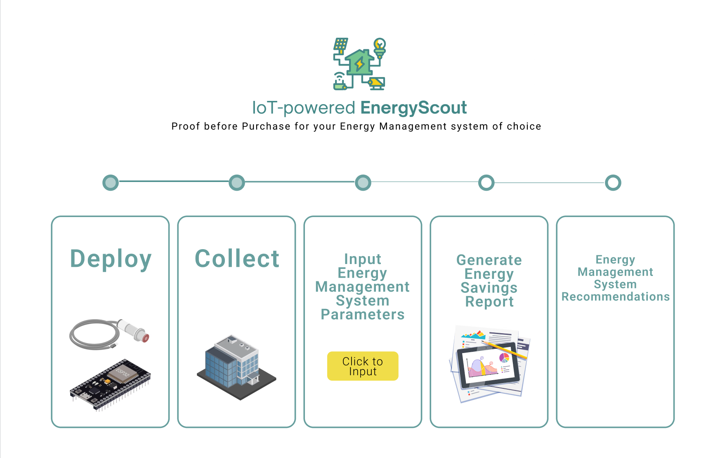

### EnergyScout
###### A lightweight, low-risk way to show hard data to unlock EMS savings using real people-flow data

Today, 30%-50% of building assets is energy inefficient according to the US EPA and it is expensive to obtain proof of cost savings of installing an Energy Management System (EMS) for one’s specific building configuration and human footfall.

Energy-scout is a low-cost, real world data driven pre-installation advisory tool to determine the feasibility of installing EMS, helping mid-to large sized companies unlock EMS savings using real people-flow data. It solves a specific pain point EMS vendors aren't addressing well: decision confidence, and at a much lower cost than EMS vendors.

## System Architecture

## Tech Stack

# Skills

# EnergyScout Simulation Software

Home Page

Shows the complete 5-stage flow of the service and stages of completion

Input EMS Parameters Screen

Shows overview of EMS parameters clients can choose from and configure for simulation

Energy Savings Report Dashboard

Shows energy saving breakdown, key metrics for decision-making (net energy savings, breakeven point, ROI etc.) and next step recommendations (eg. EMS systems from EMS vendors/companies)/custom recommmedation by platform

# Links for further info
1. [The Business Case](/BusinessCase)
2. [Project Demo](markdownpages/ProjectDemo)
4. [In Progress](markdownpages/InProgress.md)

