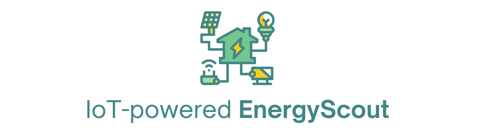

### EnergyScout
###### A lightweight, low-risk way to show hard data to unlock EMS savings using real people-flow data

Today, 60% of building assets is energy inefficient and it is expensive to obtain proof of cost savings for one’s specific building configuration and human footfall.

Energy-scout is a low-cost, real world data driven pre-installation advisory tool to determine the feasibility of installing Energy Management Systems (EMS), helping mid-to large sized companies unlock EMS savings using real people-flow data. It solves a specific pain point EMS vendors aren't addressing well: decision confidence, and at a much lower cost than EMS vendors.

# Tech Stack

# What problems does EnergyScout solve?

<table><thead><tr><th>
Problems with current EMS providers</strong>
</th><th></th></tr><tr><th>
No cheap way to obtain hardproof of cost savings would offset cost of implementing EMS (eg. upfront hardware cost, extra electricity cost, maintenance cost):</strong>
<ol><li>The energy auditing service offered by established EMS companies is expensive, and this coupled with the conception that CapEx for sensors, meters, controllers, and software licenses is significant, makes companies less willing to install EMS as the barrier to obtain data-driven proof that cost savings from EMS would offset high upfront hardware is very high.</li><li>In fact, most EMS providers <strong>must install hardware</strong> to estimate savings accurately, which requires a substantial initial investment in hardware by the company, and without proof of the exact savings, this makes installation much more undesirable.</li><li><strong>Hardware cost, extra electricity cost, maintenance Cost: </strong>Ongoing maintenance of sensors and systems also has a cost</li></ol></th><th>
Does not require full installation of EMS system in order to obtain proof of savings - minimal upfront cost

Gathers real behavioral data

<strong>Justifies</strong> investment in EMS with concrete data
</th></tr><tr><th><ol><li><strong>Awareness: </strong>SMEs often don’t realize how much energy they’re wasting</li></ol></th><th>
minimal upfront cost to obtain proof of cost savings - able to conduct energy audits for these companies
</th></tr><tr><th><ol><li><strong>Integration Complexity: </strong>Older buildings with legacy HVAC/BMS systems may face technical barriers to integration.</li></ol></th><th>
Recommendations on how to implement EMS according to the client’s specific legacy systems
</th></tr><tr><th><ol><li><strong>Disruption to operations</strong></li></ol></th><th>
No disruption to operations
</th></tr><tr><th></th><th></th></tr></thead></table>

# Tech Stack of Energy Scout

>>>>>  gd2md-html alert:  ERRORs: 0; WARNINGs: 0; ALERTS: 19.

<ul style="color: red; font-weight: bold"><li>See top comment block for details on ERRORs and WARNINGs. <li>In the converted Markdown or HTML, search for inline alerts that start with >>>>>  gd2md-html alert:  for specific instances that need correction.</ul>

Links to alert messages:
<a href="#gdcalert1">alert1</a>
<a href="#gdcalert2">alert2</a>
<a href="#gdcalert3">alert3</a>
<a href="#gdcalert4">alert4</a>
<a href="#gdcalert5">alert5</a>
<a href="#gdcalert6">alert6</a>
<a href="#gdcalert7">alert7</a>
<a href="#gdcalert8">alert8</a>
<a href="#gdcalert9">alert9</a>
<a href="#gdcalert10">alert10</a>
<a href="#gdcalert11">alert11</a>
<a href="#gdcalert12">alert12</a>
<a href="#gdcalert13">alert13</a>
<a href="#gdcalert14">alert14</a>
<a href="#gdcalert15">alert15</a>
<a href="#gdcalert16">alert16</a>
<a href="#gdcalert17">alert17</a>
<a href="#gdcalert18">alert18</a>
<a href="#gdcalert19">alert19</a>

>>>>> PLEASE check and correct alert issues and delete this message and the inline alerts.

<table>
  <tr>
   <td><strong>Dependencies</strong>
   </td>
   <td><strong>Step</strong>
   </td>
   <td><strong>Description</strong>
   </td>
   <td><strong>Client Gains</strong>
   </td>
  </tr>
  <tr>
   <td rowspan="3" ><strong>Languages Used</strong>

>>>>>  gd2md-html alert: inline image link here (to images/image1.png). Store image on your image server and adjust path/filename/extension if necessary.  (<a href="#">Back to top</a>)(<a href="#gdcalert2">Next alert</a>) >>>>> 

   </td>
   <td>

>>>>>  gd2md-html alert: inline image link here (to images/image2.png). Store image on your image server and adjust path/filename/extension if necessary.  (<a href="#">Back to top</a>)(<a href="#gdcalert3">Next alert</a>) >>>>> 

   </td>
   <td>

>>>>>  gd2md-html alert: inline image link here (to images/image3.png). Store image on your image server and adjust path/filename/extension if necessary.  (<a href="#">Back to top</a>)(<a href="#gdcalert4">Next alert</a>) >>>>> 

2 IR break-beam sensors (installed on frames of a room’s doorways) to<strong> track</strong> <strong>actual room occupancy status</strong> of rooms in the client’s place of operations/buildings
   </td>
   <td>
<h5>Gain 1: Accurate, Custom Energy Audit Without Full installation of EMS</h5>

<ul>

<li>Achieves <strong>accurate</strong> energy savings quantification <strong>based on client’s unique dataset,</strong> and <strong>without full-scale EMS installation</strong> typical of energy audits conducted by companies offering EMS products

<h5>Gain 2: Baseline hardware cost per room lower than typical energy audits offered</h5>

Baseline hardware cost per room required in EnergyScout is under $20, <strong>orders of magnitude lower</strong> than typical full scale installation of EMS systems required of energy audits.</li>

<li>Break-beam IR sensors: ~$2–5 per pair</li>

<li>ESP32 controllers: ~$5–8 each</li>

<li>Fully wireless, avoiding costly cabling or retrofittin \

<h5>Gain 3: Easy to Deploy and readily scaled</h5>

</li>

<li>EnergyScout is <strong>easy to deploy and scale </strong>across <strong>any number of rooms and buildings</strong>, as pair of IR sensor + ESP32 and be deployed headlessly to communicate with the cloud</li>
</ul>
   </td>
  </tr>
  <tr>
   <td> 

>>>>>  gd2md-html alert: inline image link here (to images/image4.png). Store image on your image server and adjust path/filename/extension if necessary.  (<a href="#">Back to top</a>)(<a href="#gdcalert5">Next alert</a>) >>>>> 

   </td>
   <td>

>>>>>  gd2md-html alert: inline image link here (to images/image5.png). Store image on your image server and adjust path/filename/extension if necessary.  (<a href="#">Back to top</a>)(<a href="#gdcalert6">Next alert</a>) >>>>> 

IR Break-beam sensor data fed to microcontroller ESP32, which, throughout 24 hrs, <strong>locally writes</strong> each change in room occupancy log (in CSV format) to the <strong>ESP32’s own internal memory</strong> (SPIFFS/LittleFS) 

ESP32 only conducts <strong>once-every-24-hrs</strong> upload of the room’s <strong>CSV occupancy logs</strong> for the day, via WiFi connection, to the database hosted on the cloud
   </td>
   <td>
<h5>Gain 4: EnergyScout System Architecture consumes minimal power</h5>

<ul>

<li><strong>Idle monitoring:</strong> IR sensor triggers via GPIO (Saves power as ESP32 in light sleep or idle mode)</li>

<li><strong>All-day Internal-memory writes of occupancy logs:</strong> ESP32 local write to SPIFFS (low power used as no peripherals used, fast writes)</li>

<li><strong>Wifi off all-day</strong> (saves 100-200mA)</li>

<li><strong>Once-per-day upload:</strong> Establish wifi connection for 1-2min at most (High power consumption but only temporarily)) \
</li>
</ul>
   </td>
  </tr>
  <tr>
   <td>

>>>>>  gd2md-html alert: inline image link here (to images/image6.png). Store image on your image server and adjust path/filename/extension if necessary.  (<a href="#">Back to top</a>)(<a href="#gdcalert7">Next alert</a>) >>>>> 

   </td>
   <td>

>>>>>  gd2md-html alert: inline image link here (to images/image7.png). Store image on your image server and adjust path/filename/extension if necessary.  (<a href="#">Back to top</a>)(<a href="#gdcalert8">Next alert</a>) >>>>> 

ESP-32 connects to building router<strong> </strong>once per day to <strong>upload data of occupancy logs</strong> of each room to IoT database
   </td>
   <td>
   </td>
  </tr>
  <tr>
   <td><strong>NoSQL Database Used:</strong>

>>>>>  gd2md-html alert: inline image link here (to images/image8.png). Store image on your image server and adjust path/filename/extension if necessary.  (<a href="#">Back to top</a>)(<a href="#gdcalert9">Next alert</a>) >>>>> 

<strong>Packages Used</strong>

>>>>>  gd2md-html alert: inline image link here (to images/image9.png). Store image on your image server and adjust path/filename/extension if necessary.  (<a href="#">Back to top</a>)(<a href="#gdcalert10">Next alert</a>) >>>>> 

   </td>
   <td>

>>>>>  gd2md-html alert: inline image link here (to images/image10.png). Store image on your image server and adjust path/filename/extension if necessary.  (<a href="#">Back to top</a>)(<a href="#gdcalert11">Next alert</a>) >>>>> 

   </td>
   <td>

>>>>>  gd2md-html alert: inline image link here (to images/image11.png). Store image on your image server and adjust path/filename/extension if necessary.  (<a href="#">Back to top</a>)(<a href="#gdcalert12">Next alert</a>) >>>>> 

<ol>

<li>CSV logs of each room are combined in the database to form one combined CSV <strong>detailing all employee movement for</strong> <strong>that day</strong></li>

<li>Pipeline is repeated for <strong>X</strong> number of days (as many as specified by client for a larger, more reflective dataset)</li>

<li>Each individual combined CSV of each day is combined to form <strong>full CSV for the assessment period</strong></li>
</ol>
   </td>
   <td>
<h5>Gain 5: Hosted on free Cloud database, furthering lowering cost</h5>

<ul>

<li>Free Tier of InfluxDB Cloud allows <strong>10,000 writes/day</strong> (more than enough) and <strong>30-day data retention</strong> (more than MongoDB) \

<h5>Gain 6: Scalable, Lightweight Cloud Data Processing</h5>

</li>

<li>Choice of lightweight cloud storage and processing makes EnergyScout <strong>easy to deploy and scale </strong>as any number of CSVs can be easily combined, visualized, and exported as the full picture of a building’s human traffic. </li>

<li>It is also in a suitable format to be displayed as a <strong>multi-day movement heatmap.</strong> \
<strong>.</strong></li>
</ul>
   </td>
  </tr>
  <tr>
   <td><strong>Languages used:</strong>

>>>>>  gd2md-html alert: inline image link here (to images/image12.png). Store image on your image server and adjust path/filename/extension if necessary.  (<a href="#">Back to top</a>)(<a href="#gdcalert13">Next alert</a>) >>>>> 

<strong>Packages Used:</strong>

>>>>>  gd2md-html alert: inline image link here (to images/image13.png). Store image on your image server and adjust path/filename/extension if necessary.  (<a href="#">Back to top</a>)(<a href="#gdcalert14">Next alert</a>) >>>>> 

>>>>>  gd2md-html alert: inline image link here (to images/image14.png). Store image on your image server and adjust path/filename/extension if necessary.  (<a href="#">Back to top</a>)(<a href="#gdcalert15">Next alert</a>) >>>>> 

<strong>Languages used for frontend:</strong>

>>>>>  gd2md-html alert: inline image link here (to images/image15.png). Store image on your image server and adjust path/filename/extension if necessary.  (<a href="#">Back to top</a>)(<a href="#gdcalert16">Next alert</a>) >>>>> 

>>>>>  gd2md-html alert: inline image link here (to images/image16.png). Store image on your image server and adjust path/filename/extension if necessary.  (<a href="#">Back to top</a>)(<a href="#gdcalert17">Next alert</a>) >>>>> 

>>>>>  gd2md-html alert: inline image link here (to images/image17.png). Store image on your image server and adjust path/filename/extension if necessary.  (<a href="#">Back to top</a>)(<a href="#gdcalert18">Next alert</a>) >>>>> 

   </td>
   <td>

>>>>>  gd2md-html alert: inline image link here (to images/image18.png). Store image on your image server and adjust path/filename/extension if necessary.  (<a href="#">Back to top</a>)(<a href="#gdcalert19">Next alert</a>) >>>>> 

   </td>
   <td>

>>>>>  gd2md-html alert: inline image link here (to images/image19.png). Store image on your image server and adjust path/filename/extension if necessary.  (<a href="#">Back to top</a>)(<a href="#gdcalert20">Next alert</a>) >>>>> 

<ol>

<li>Full CSV for the assessment period is downloaded from database</li>

<li>This CSV inputted into Energy-Scout Simulation Software and calculate energy savings for the assessment period </li>
</ol>
   </td>
   <td>
<h5>Gain 7: EnergyScout Simulation Software</h5>

EnergyScout Simulation Software calculates energy savings <strong>based on</strong> real<strong> people-flow data collected</strong> and <strong>client’s choice of EMS parameters</strong>
<ul>

<li>Allows clients to adjust EMS parameters:</li> 
<ul>
 
<li><strong>Essential VS Non-essential rooms</strong> (e.g. per-room control vs zonal control)</li>
 
<li><strong>Sensor types</strong> (used in combination or in isolation) and their<strong> corresponding energy consumption</strong> factored into calculation</li>
 
<li>Factor in <strong>differences in kilowatt consumption of each room</strong></li>
 
<li>EMS overall architecture structure</li>
 
<li>…and many more</li>

<li>Based on parameters chosen, outputs a <strong>projected energy savings report</strong> that<strong> factors in</strong>:</li> 
<ul>
 
<li><strong>Upfront cost of the hardware</strong>, </li> 
</ul>
 
<li><strong>The recorded energy usage of sensors </strong>across the assessment period </li>
 
<li><strong>Maintenance fees of EMS hardware configuration </strong>chosen</li>
 
<li>And balances it against energy savings to <strong>calculate metrics key for decision making</strong>:</li>  
<ul>
  
<li>Net cost savings of installing EMS system</li>
  
<li>Breakeven period (eg. in X number of years) of chosen EMS configuration</li>
  
<li>Return on investment (ROI) </li>
  
<li>Breakdown of savings per year</li>  
</ul></li>  
</ul></li>  
</ul>
   </td>
  </tr>
