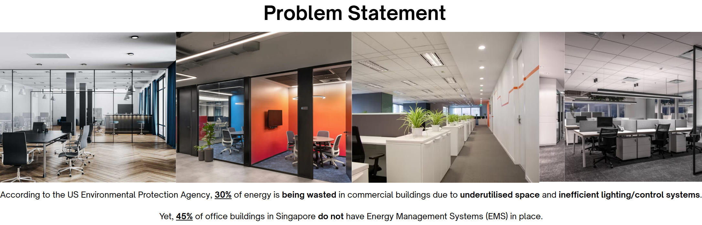

# Barrier to adoption
The energy auditing service offered by established EMS companies is **expensive**, hence there is no cheap way to obtain cost savings that EMS would offset installation cost (eg. upfront hardware cost, extra electricity cost, maintenance cost), increasing the barrier to implementing EMS.

# Price Comparison

To get energy savings quantification based on unique dataset of clients, EnergyScout tool could be deployed for **<1% the cost** of a normal energy audit offered by EMS companies.

| **Feature** | **Current EMS vendors** | **EnergyScout** |
| ----------- | ----------- |--|
| Hardware Cost (Per Room) | $150–$1,000 (with smart relays, sensors, BMS integration) | ~$15–20  |
| Install Time | 1–3 hours per room + certified technician | 15–30 mins (DIY or light contractor) |
| Software License | $1,000s/year | Free or flat-rate simulation engine |
| System Intrusion | Full integration into light/HVAC | Zero disruption, data only |
| Data Collection Period | Only post-install | Pre-install, real usage logs |
| Advisory Service | Paid consulting or bundled with EMS | Free/low-cost standalone advisory |
| Scalability to 10+ Rooms | High cost + complexity | Just add ESPs + IRs |

