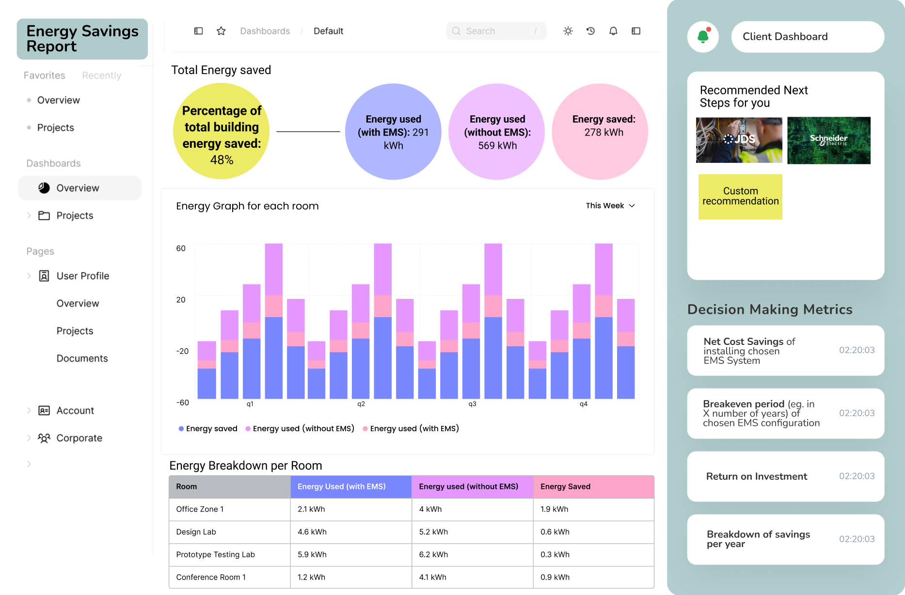

# EnergyScout Simulation Software

<h2 align="center"><strong>Screen 1: EnergyScout Homepage</strong></h2>

Shows the complete 5-stage flow of the service and stages of completion.

<h2 align="center"><strong>Screen 2: Input EMS Parameters Screen</strong></h2>

*Shows overview of EMS parameters clients can choose from and configure for simulation.

<h2 align="center"><strong>Screen 3: Energy Savings Report Dashboard</strong></h2>

Shows energy saving breakdown, key metrics for decision-making (net energy savings, breakeven point, ROI etc.) and next step recommendations (eg. EMS systems from EMS vendors/companies)/custom recommmedation by platform.

